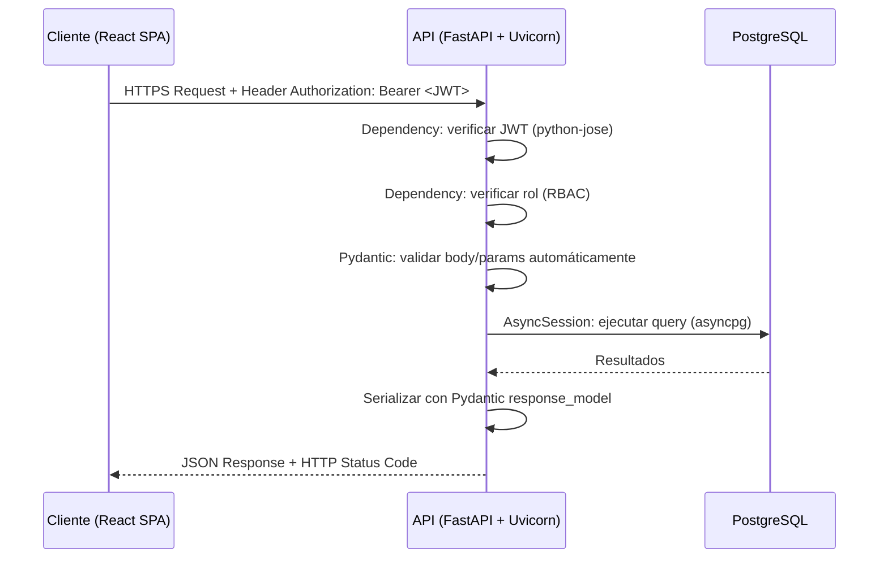

# Documento de Diseño — Sistema de Gestión de Citas Médicas

## 1. Introducción

### 1.1 Propósito
Diseñar e implementar un sistema distribuido para la gestión de citas médicas que permita a pacientes reservar consultas y a médicos administrar historiales clínicos, con mecanismos de concurrencia distribuida, seguridad y comunicación vía servicios web.

### 1.2 Alcance
- Gestión de pacientes (CRUD)
- Reserva de citas médicas con exclusión mutua distribuida
- Registro de historia clínica (encriptada)
- Generación de reportes
- Sistema de notificaciones
- Dos roles: Paciente y Médico (administrador)

### 1.3 Stack Tecnológico Seleccionado

| Capa | Tecnología | Justificación |
|------|-----------|---------------|
| Presentación | React + Vite | SPA moderna, componentes reutilizables |
| Lógica de Negocio | Python + FastAPI | Framework asíncrono de alto rendimiento con validación automática |
| Datos | PostgreSQL | ACID compliant, soporte nativo para bloqueos de fila |
| ORM | SQLAlchemy 2.0 + asyncpg | ORM maduro con soporte async nativo para PostgreSQL |
| Comunicación | REST + JSON | Estándar HTTP, interoperabilidad entre dispositivos |
| Seguridad | JWT + passlib[bcrypt] + cryptography | Tokens stateless, hashing seguro, encriptación simétrica |

### 1.4 Justificación de Elecciones Tecnológicas

#### ¿Por qué **React + Vite** para la Capa de Presentación?

| Criterio | React + Vite | Alternativas consideradas |
|----------|-------------|--------------------------|
| **Rendimiento** | Vite usa ESBuild para compilación ultrarrápida (~10x más rápido que Webpack). Hot Module Replacement (HMR) instantáneo durante desarrollo. | Create React App (CRA) fue descontinuado oficialmente; Next.js agrega complejidad de SSR innecesaria para este caso de uso. |
| **Ecosistema** | React cuenta con la mayor comunidad y librería de componentes del ecosistema frontend. React Router v6 ofrece routing declarativo. | Vue.js y Angular son alternativas viables, pero React tiene mayor adopción en el mercado y más recursos de aprendizaje disponibles. |
| **Modelo SPA** | La aplicación requiere interacciones dinámicas (calendarios, notificaciones en tiempo real, formularios multistep) que se benefician del modelo SPA sin recargas de página. | Un enfoque MPA (Multi-Page Application) con templates del servidor sería más simple pero ofrecería una experiencia de usuario inferior para flujos interactivos como la reserva de citas. |
| **Separación de capas** | React como SPA se comunica exclusivamente vía REST con el backend, garantizando una separación total entre la capa de presentación y la lógica de negocio. Esto favorece la heterogeneidad de dispositivos: el mismo backend puede servir a un futuro cliente móvil. | Un enfoque con templates renderizados en el servidor (Jinja2, Django Templates) acoplaría la presentación con el backend, dificultando la reutilización de la API. |

#### ¿Por qué **Python + FastAPI** para la Capa de Lógica de Negocio?

| Criterio | Python + FastAPI | Alternativas consideradas |
|----------|-----------------|--------------------------|
| **Rendimiento asíncrono** | FastAPI está construido sobre Starlette y soporta `async/await` nativo, lo cual es crítico para manejar múltiples reservas concurrentes sin bloquear el event loop. Benchmark: ~15,000 req/s en endpoints simples. | Flask es síncrono por defecto (requiere extensiones como gevent). Django REST Framework es más pesado y su naturaleza síncrona lo hace menos adecuado para operaciones concurrentes de I/O. |
| **Validación automática** | FastAPI usa **Pydantic v2** para validar y serializar datos automáticamente a partir de type hints de Python. Los esquemas de request/response se definen una sola vez y generan validación, documentación y serialización. | Express.js requiere librerías adicionales (express-validator, Joi) para validación. Flask requiere Marshmallow o similar. FastAPI elimina esta capa de complejidad adicional. |
| **Documentación automática** | FastAPI genera automáticamente documentación interactiva **Swagger UI** (`/docs`) y **ReDoc** (`/redoc`) a partir del código, sin configuración adicional. Esto es valioso para un sistema de servicios web donde se necesita documentar los endpoints. | En Express/Flask la documentación Swagger requiere decoradores manuales o librerías adicionales (swagger-jsdoc, flask-restx). |
| **Type safety** | Los type hints de Python, combinados con Pydantic, proporcionan detección de errores en tiempo de desarrollo y autocompletado en IDEs, reduciendo bugs en producción. | JavaScript carece de tipado estático nativo (TypeScript lo agrega pero con overhead de configuración). |
| **Inyección de dependencias** | FastAPI incluye un sistema de inyección de dependencias nativo (`Depends()`) que simplifica la gestión de sesiones de BD, autenticación y autorización sin acoplar la lógica de negocio. | Express usa middleware encadenado, que es funcional pero menos explícito. Django usa decoradores pero con menos flexibilidad. |
| **Ecosistema Python para salud** | Python es el lenguaje dominante en aplicaciones de salud y datos. Librerías como `cryptography` (auditoría de seguridad profesional), `reportlab` (generación de PDFs) y el ecosistema científico están maduros y bien mantenidos. | El ecosistema Node.js tiene equivalentes pero con menor madurez en el dominio de salud. |

#### ¿Por qué **PostgreSQL** para la Capa de Datos?

| Criterio | PostgreSQL | Alternativas consideradas |
|----------|-----------|--------------------------|
| **Cumplimiento ACID** | PostgreSQL garantiza Atomicidad, Consistencia, Aislamiento y Durabilidad, propiedades esenciales para un sistema médico donde la integridad de los datos es crítica (reservas, historiales clínicos). | MySQL/MariaDB cumplen ACID con InnoDB, pero PostgreSQL ofrece niveles de aislamiento más robustos (TRUE SERIALIZABLE vs. gap locking). MongoDB (NoSQL) no garantiza ACID multi-documento de forma nativa. |
| **Bloqueo a nivel de fila** | `SELECT ... FOR UPDATE` permite bloqueo granular de filas individuales, esencial para el mecanismo de exclusión mutua en la reserva de citas. Solo se bloquea el horario específico, no toda la tabla. | MySQL soporta `FOR UPDATE` pero su implementación de SERIALIZABLE usa gap locking que puede bloquear rangos innecesarios. |
| **Transacciones SERIALIZABLE** | PostgreSQL implementa Serializable Snapshot Isolation (SSI), que permite verdadero aislamiento serializable con mejor rendimiento que el bloqueo tradicional. | MySQL usa bloqueo de rango (gap locks) para SERIALIZABLE, lo que puede causar más deadlocks y menor throughput en escenarios de alta concurrencia. |
| **JSONB nativo** | El tipo `JSONB` permite almacenar datos semi-estructurados (como las referencias en notificaciones) con indexación y consultas eficientes. | MySQL agregó soporte JSON pero con menos funcionalidades de indexación y consulta. |
| **pgcrypto** | Extensión nativa para funciones criptográficas directamente en la base de datos como capa adicional de seguridad. | Otros SGBD requieren extensiones de terceros o implementación a nivel de aplicación exclusivamente. |
| **Madurez y confiabilidad** | +35 años de desarrollo, ampliamente usado en sistemas de salud, finanzas y gobierno. Cumple con estándares SQL de forma rigurosa. | SQLite es excelente para desarrollo pero no para producción multi-usuario concurrente. |

#### ¿Por qué **SQLAlchemy 2.0 + asyncpg** como ORM?

| Criterio | SQLAlchemy 2.0 | Alternativas |
|----------|---------------|--------------|
| **Async nativo** | SQLAlchemy 2.0 soporta sesiones asíncronas (`AsyncSession`) sobre `asyncpg`, alineándose con la naturaleza async de FastAPI. | Tortoise ORM es async nativo pero menos maduro. SQLAlchemy es el ORM más usado en Python con documentación exhaustiva. |
| **Flexibilidad** | Permite usar tanto el ORM de alto nivel (modelos declarativos) como SQL crudo cuando se necesita control fino (ej: `SELECT FOR UPDATE`). | Django ORM es poderoso pero está acoplado al framework Django. Peewee es más simple pero carece de soporte async. |
| **Migraciones** | Se integra con **Alembic** para migraciones de esquema versionadas y reversibles. | Equivalente a Knex.js en Node.js, pero con mejor integración al ecosistema Python. |

#### ¿Por qué **REST + JSON** como protocolo de comunicación?

| Criterio | REST + JSON | Alternativas |
|----------|------------|--------------|
| **Universalidad** | HTTP es el protocolo más soportado. Cualquier cliente (web, móvil, IoT) puede consumir una API REST sin librerías especializadas. | GraphQL ofrece mayor flexibilidad en consultas pero agrega complejidad innecesaria para un dominio con entidades bien definidas. gRPC es más eficiente pero requiere Protobuf y es menos amigable para clientes web. |
| **Simplicidad** | Los verbos HTTP (GET, POST, PUT, DELETE) se mapean directamente a operaciones CRUD, facilitando el diseño y la comprensión de la API. | SOAP (XML) es más verboso y complejo de implementar y consumir. |
| **Heterogeneidad** | El requisito especifica que los servicios web deben favorecer la heterogeneidad de dispositivos. REST + JSON es el estándar de facto para APIs web consumidas por múltiples plataformas. | WebSockets se usarán complementariamente si se requieren notificaciones push en tiempo real. |
| **Cacheabilidad** | Las respuestas REST pueden cachearse a nivel de HTTP (ETags, Cache-Control), mejorando el rendimiento sin lógica adicional. | GraphQL no es cacheable por naturaleza en la capa HTTP debido a que usa POST para todo. |

#### ¿Por qué **JWT + passlib + cryptography** para seguridad?

| Criterio | JWT + passlib + cryptography | Alternativas |
|----------|----------------------------|--------------|
| **Stateless auth** | JWT permite autenticación sin almacenar sesiones en el servidor, lo cual es fundamental para sistemas distribuidos y escalabilidad horizontal. | Sesiones de servidor (cookies + Redis) requieren almacenamiento compartido entre instancias. OAuth2 completo es excesivo para un sistema con un único proveedor de identidad. |
| **passlib[bcrypt]** | Librería de Python auditada profesionalmente para hashing de contraseñas. bcrypt con 12 rounds ofrece ~250ms por hash, resistente a ataques de fuerza bruta y rainbow tables. | `hashlib` de la stdlib es para hashing general, no para contraseñas. Argon2 es más moderno pero bcrypt sigue siendo el estándar de la industria con mejor soporte. |
| **cryptography** | Librería de referencia en Python para criptografía, mantenida por la Python Cryptographic Authority. Soporta AES-256-GCM con autenticación integrada. | PyCryptodome es funcional pero `cryptography` tiene mejor mantenimiento y auditorías de seguridad. |

---

## 2. Arquitectura del Sistema (3 Capas)

### 2.1 Diagrama de Arquitectura

```
┌─────────────────────────────────────────────────┐
│            CAPA DE PRESENTACIÓN                 │
│         (React + Vite — SPA Web)                │
│                                                 │
│  ┌──────────┐ ┌──────────┐ ┌──────────────────┐│
│  │  Login   │ │  Citas   │ │ Historial Clínico││
│  └──────────┘ └──────────┘ └──────────────────┘│
│  ┌──────────┐ ┌──────────┐ ┌──────────────────┐│
│  │Pacientes │ │ Reportes │ │  Notificaciones  ││
│  └──────────┘ └──────────┘ └──────────────────┘│
└────────────────────┬────────────────────────────┘
                     │ HTTPS / REST + JSON
                     ▼
┌─────────────────────────────────────────────────┐
│         CAPA DE LÓGICA DE NEGOCIO               │
│        (Python + FastAPI — Uvicorn ASGI)        │
│                                                 │
│  ┌────────────────┐  ┌────────────────────────┐ │
│  │ Auth Router    │  │ Patients Router        │ │
│  │(JWT + passlib) │  │ (CRUD patients)        │ │
│  └────────────────┘  └────────────────────────┘ │
│  ┌────────────────┐  ┌────────────────────────┐ │
│  │ Appointments   │  │ Medical Records Router │ │
│  │ Router (Mutex) │  │ (AES-256 encrypt)      │ │
│  └────────────────┘  └────────────────────────┘ │
│  ┌────────────────┐  ┌────────────────────────┐ │
│  │Reports Router  │  │ Notifications Router   │ │
│  └────────────────┘  └────────────────────────┘ │
│  ┌────────────────────────────────────────────┐ │
│  │  Dependencies: Auth, DB Session, RBAC     │ │
│  └────────────────────────────────────────────┘ │
│  ┌────────────────────────────────────────────┐ │
│  │  Middleware: CORS, Rate Limit, Logging    │ │
│  └────────────────────────────────────────────┘ │
└────────────────────┬────────────────────────────┘
                     │ asyncpg (TCP/5432)
                     ▼
┌─────────────────────────────────────────────────┐
│             CAPA DE DATOS                       │
│            (PostgreSQL 16)                      │
│                                                 │
│  ┌──────────┐ ┌─────────────┐ ┌────────────────┐│
│  │  users   │ │appointments │ │medical_records ││
│  └──────────┘ └─────────────┘ └────────────────┘│
│  ┌──────────┐ ┌───────────────┐ ┌───────────┐   │
│  │ patients │ │ notifications │ │  doctors  │   │
│  └──────────┘ └───────────────┘ └───────────┘   │
│                                                 │
│  Funciones: row-level locking, triggers,        │
│  SERIALIZABLE isolation, pgcrypto               │
└─────────────────────────────────────────────────┘
```

### 2.2 Flujo de Comunicación



1. El **cliente** (navegador) envía peticiones HTTPS con header `Authorization: Bearer <JWT>`.
2. FastAPI ejecuta las **dependencias** en cadena: verifica el token JWT, extrae el usuario, verifica permisos RBAC.
3. **Pydantic** valida automáticamente el body, query params y path params contra los esquemas definidos.
4. El servicio ejecuta la lógica de negocio usando una **AsyncSession** de SQLAlchemy sobre asyncpg.
5. La respuesta se serializa automáticamente con el `response_model` de Pydantic y se envía como JSON.

### 2.3 Principios de Diseño

- **Stateless**: Cada petición contiene toda la información necesaria (JWT). El servidor no almacena sesiones.
- **Separación de responsabilidades**: Cada capa tiene una función específica y se comunica mediante interfaces bien definidas (REST).
- **Transparencia de red**: El cliente no conoce la ubicación física del servidor ni los detalles de implementación del backend.
- **Seguridad en profundidad**: Múltiples capas de defensa (HTTPS, JWT, RBAC, bcrypt, AES-256-GCM, rate limiting).
- **Async-first**: Todas las operaciones de I/O (base de datos, red) son asíncronas, maximizando el throughput bajo carga concurrente.
- **Fail-fast validation**: Pydantic rechaza datos inválidos antes de que lleguen a la lógica de negocio, reduciendo la superficie de errores.

### 2.4 Decisiones Arquitectónicas Clave

| Decisión | Elección | Razón |
|----------|---------|-------|
| Modelo de capas | 3 capas estrictas | Requisito del proyecto; permite independencia entre presentación, lógica y datos |
| Comunicación entre capas | REST + JSON vía HTTP | Favorece heterogeneidad de dispositivos (requisito); desacoplamiento total |
| Servidor ASGI | Uvicorn | Servidor ASGI de producción para FastAPI, basado en uvloop (libuv binding para Python) |
| Patrón de proyecto | Repository + Service | Los routers delegan a servicios que encapsulan lógica de negocio; los servicios usan SQLAlchemy para acceso a datos |
| Gestión de sesiones DB | AsyncSession con context manager | Cada request obtiene su propia sesión; se hace commit/rollback automáticamente al finalizar |
| Formato de errores | Esquema unificado `{success, error: {code, message}}` | Consistencia en toda la API para facilitar el manejo de errores en el frontend |
