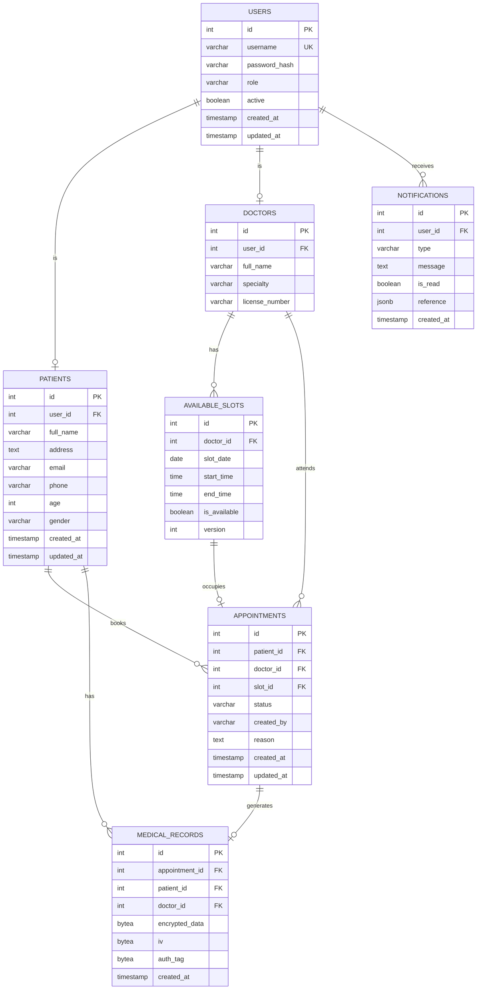

# 3. Diseño de la Base de Datos

## 3.1 Diagrama Entidad-Relación (Mermaid)



## 3.2 Esquema SQL Detallado

### Tabla: `users`
```sql
CREATE TABLE users (
    id            SERIAL PRIMARY KEY,
    username      VARCHAR(50) UNIQUE NOT NULL,
    password_hash VARCHAR(255) NOT NULL,  -- bcrypt hash
    role          VARCHAR(20) NOT NULL CHECK (role IN ('patient', 'doctor')),
    active        BOOLEAN DEFAULT TRUE,
    created_at    TIMESTAMP DEFAULT CURRENT_TIMESTAMP,
    updated_at    TIMESTAMP DEFAULT CURRENT_TIMESTAMP
);
CREATE INDEX idx_users_username ON users(username);
```

### Tabla: `patients`
```sql
CREATE TABLE patients (
    id          SERIAL PRIMARY KEY,
    user_id     INT UNIQUE NOT NULL REFERENCES users(id) ON DELETE CASCADE,
    full_name   VARCHAR(150) NOT NULL,
    address     TEXT,
    email       VARCHAR(150) NOT NULL,
    phone       VARCHAR(20),
    age         INT CHECK (age > 0 AND age < 150),
    gender      VARCHAR(20) CHECK (gender IN ('male', 'female', 'other')),
    created_at  TIMESTAMP DEFAULT CURRENT_TIMESTAMP,
    updated_at  TIMESTAMP DEFAULT CURRENT_TIMESTAMP
);
CREATE INDEX idx_patients_user ON patients(user_id);
```

### Tabla: `doctors`
```sql
CREATE TABLE doctors (
    id              SERIAL PRIMARY KEY,
    user_id         INT UNIQUE NOT NULL REFERENCES users(id) ON DELETE CASCADE,
    full_name       VARCHAR(150) NOT NULL,
    specialty       VARCHAR(100),
    license_number  VARCHAR(50) UNIQUE
);
```

### Tabla: `available_slots`
```sql
CREATE TABLE available_slots (
    id           SERIAL PRIMARY KEY,
    doctor_id    INT NOT NULL REFERENCES doctors(id),
    slot_date    DATE NOT NULL,
    start_time   TIME NOT NULL,
    end_time     TIME NOT NULL,
    is_available BOOLEAN DEFAULT TRUE,
    version      INT DEFAULT 1,  -- Para control de concurrencia optimista
    UNIQUE(doctor_id, slot_date, start_time)
);
CREATE INDEX idx_slots_date ON available_slots(slot_date, is_available);
```

### Tabla: `appointments`
```sql
CREATE TABLE appointments (
    id          SERIAL PRIMARY KEY,
    patient_id  INT NOT NULL REFERENCES patients(id),
    doctor_id   INT NOT NULL REFERENCES doctors(id),
    slot_id     INT NOT NULL REFERENCES available_slots(id),
    status      VARCHAR(20) DEFAULT 'scheduled'
                CHECK (status IN ('scheduled','completed','cancelled')),
    created_by  VARCHAR(20) NOT NULL CHECK (created_by IN ('patient','doctor')),
    reason      TEXT,
    created_at  TIMESTAMP DEFAULT CURRENT_TIMESTAMP,
    updated_at  TIMESTAMP DEFAULT CURRENT_TIMESTAMP
);
CREATE INDEX idx_appointments_patient ON appointments(patient_id);
CREATE INDEX idx_appointments_doctor ON appointments(doctor_id);
CREATE INDEX idx_appointments_status ON appointments(status);
```

### Tabla: `medical_records`
```sql
CREATE TABLE medical_records (
    id               SERIAL PRIMARY KEY,
    appointment_id   INT UNIQUE NOT NULL REFERENCES appointments(id),
    patient_id       INT NOT NULL REFERENCES patients(id),
    doctor_id        INT NOT NULL REFERENCES doctors(id),
    encrypted_data   BYTEA NOT NULL,     -- JSON encriptado con AES-256-GCM
    iv               BYTEA NOT NULL,     -- Vector de inicialización
    auth_tag         BYTEA NOT NULL,     -- Tag de autenticación GCM
    created_at       TIMESTAMP DEFAULT CURRENT_TIMESTAMP
);
CREATE INDEX idx_records_patient ON medical_records(patient_id);
```

**Estructura del JSON antes de encriptar** (campo `encrypted_data`):
```json
{
  "vital_signs": {
    "body_temperature": 36.5,
    "weight_kg": 70.2,
    "height_cm": 175,
    "blood_pressure": "120/80"
  },
  "diagnosis": "Texto del diagnóstico",
  "lab_results": "Resultados de laboratorio",
  "prescriptions": "Medicamentos prescritos",
  "notes": "Notas adicionales del médico"
}
```

### Tabla: `notifications`
```sql
CREATE TABLE notifications (
    id          SERIAL PRIMARY KEY,
    user_id     INT NOT NULL REFERENCES users(id),
    type        VARCHAR(50) NOT NULL,
    message     TEXT NOT NULL,
    is_read     BOOLEAN DEFAULT FALSE,
    reference   JSONB,  -- {"type": "appointment", "id": 123}
    created_at  TIMESTAMP DEFAULT CURRENT_TIMESTAMP
);
CREATE INDEX idx_notifications_user ON notifications(user_id, is_read);
```

## 3.3 Mapeo de Nombres (Español → Inglés)

| Nombre original (ES) | Nombre actual (EN) | Tabla |
|----------------------|-------------------|-------|
| `usuarios` | `users` | — |
| `rol` | `role` | users |
| `activo` | `active` | users |
| `pacientes` | `patients` | — |
| `usuario_id` | `user_id` | patients, doctors |
| `nombre` | `full_name` | patients, doctors |
| `direccion` | `address` | patients |
| `correo_electronico` | `email` | patients |
| `telefono` | `phone` | patients |
| `edad` | `age` | patients |
| `sexo` | `gender` | patients |
| `medicos` | `doctors` | — |
| `especialidad` | `specialty` | doctors |
| `cedula_profesional` | `license_number` | doctors |
| `horarios_disponibles` | `available_slots` | — |
| `fecha` | `slot_date` | available_slots |
| `hora_inicio` | `start_time` | available_slots |
| `hora_fin` | `end_time` | available_slots |
| `disponible` | `is_available` | available_slots |
| `citas` | `appointments` | — |
| `horario_id` | `slot_id` | appointments |
| `estado` | `status` | appointments |
| `creado_por` | `created_by` | appointments |
| `motivo_consulta` | `reason` | appointments |
| `historial_clinico` | `medical_records` | — |
| `cita_id` | `appointment_id` | medical_records |
| `datos_encriptados` | `encrypted_data` | medical_records |
| `notificaciones` | `notifications` | — |
| `mensaje` | `message` | notifications |
| `leida` | `is_read` | notifications |
| `referencia` | `reference` | notifications |

## 3.4 Restricciones de Integridad

| Restricción | Implementación |
|-------------|---------------|
| Un paciente no puede tener dos citas en el mismo horario | UNIQUE constraint en `available_slots(doctor_id, slot_date, start_time)` + validación en lógica de negocio |
| Un horario solo puede tener una cita activa | Flag `is_available` + bloqueo optimista con `version` |
| Contraseñas nunca en texto plano | bcrypt con salt de 12 rounds |
| Historial clínico siempre encriptado | AES-256-GCM antes de INSERT |
| Eliminación en cascada al borrar usuario | `ON DELETE CASCADE` en FK |
