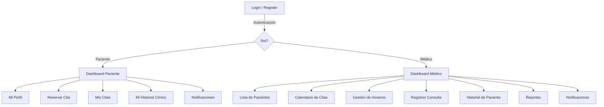

# 7. Descripción de la Interfaz de Usuario

## 7.1 Mapa de Navegación



## 7.2 Pantallas Principales

### 7.2.1 Login / Registro
- Formulario de login con username y contraseña
- Link a formulario de registro para pacientes nuevos
- Validación en tiempo real de campos
- Mensajes de error claros para credenciales inválidas

### 7.2.2 Dashboard Paciente
- Resumen: próxima cita, notificaciones sin leer
- Acceso rápido a reservar nueva cita
- Lista de citas programadas con opción de cancelar

### 7.2.3 Dashboard Médico
- Resumen del día: citas programadas para hoy
- Acceso rápido a la lista de pacientes
- Calendario visual con las citas de la semana
- Indicador de notificaciones

### 7.2.4 Reserva de Citas (Paciente)
- Selector de fecha con calendario visual
- Grid de horarios disponibles para la fecha seleccionada
- Los horarios no disponibles se muestran deshabilitados
- Confirmación modal antes de reservar
- Manejo visual de conflictos de concurrencia (alerta si el horario fue tomado)

### 7.2.5 Registro de Consulta (Médico)
- Selección de la cita/paciente
- Formulario de signos vitales: temperatura, peso, altura, presión arterial
- Áreas de texto para diagnóstico, resultados, prescripciones y observaciones
- Botón de guardar con confirmación

### 7.2.6 Historial Clínico
- Encabezado con datos generales del paciente
- Lista cronológica de consultas con detalles expandibles
- Cada entrada muestra: fecha, signos vitales, diagnóstico, prescripciones

### 7.2.7 Reportes (Médico)
- Lista de pacientes con filtros de búsqueda
- Calendario de citas con vista mensual/semanal
- Historial clínico completo con opción de exportar

---

# 8. Estructura del Proyecto

```
sd-project/
├── docs/                               # Documentación de diseño
│   ├── 01_arquitectura.md
│   ├── 02_base_datos.md
│   ├── 03_servicios_web.md
│   ├── 04_concurrencia.md
│   ├── 05_seguridad.md
│   └── 06_interfaz_estructura.md
│
├── backend/                            # Capa de Lógica + Datos (Python)
│   ├── app/
│   │   ├── __init__.py
│   │   ├── main.py                     # FastAPI app + middleware setup
│   │   ├── config.py                   # Settings con pydantic-settings
│   │   ├── database.py                 # AsyncEngine + AsyncSession factory
│   │   ├── dependencies.py             # Depends: get_db, auth, RBAC
│   │   │
│   │   ├── models/                     # SQLAlchemy ORM models
│   │   │   ├── __init__.py
│   │   │   ├── usuario.py
│   │   │   ├── paciente.py
│   │   │   ├── medico.py
│   │   │   ├── horario.py
│   │   │   ├── cita.py
│   │   │   ├── historial.py
│   │   │   └── notificacion.py
│   │   │
│   │   ├── schemas/                    # Pydantic v2 schemas (request/response)
│   │   │   ├── __init__.py
│   │   │   ├── auth.py
│   │   │   ├── paciente.py
│   │   │   ├── cita.py
│   │   │   ├── historial.py
│   │   │   ├── notificacion.py
│   │   │   └── reporte.py
│   │   │
│   │   ├── routers/                    # FastAPI APIRouter por dominio
│   │   │   ├── __init__.py
│   │   │   ├── auth.py
│   │   │   ├── pacientes.py
│   │   │   ├── citas.py
│   │   │   ├── historial.py
│   │   │   ├── notificaciones.py
│   │   │   └── reportes.py
│   │   │
│   │   ├── services/                   # Lógica de negocio
│   │   │   ├── __init__.py
│   │   │   ├── auth_service.py
│   │   │   ├── pacientes_service.py
│   │   │   ├── citas_service.py        # Incluye lógica de concurrencia
│   │   │   ├── historial_service.py    # Incluye encriptación AES
│   │   │   ├── notificaciones_service.py
│   │   │   └── reportes_service.py
│   │   │
│   │   └── utils/
│   │       ├── __init__.py
│   │       ├── encryption.py           # AES-256-GCM helpers
│   │       └── security.py             # JWT + passlib helpers
│   │
│   ├── alembic/                        # Migraciones de base de datos
│   │   ├── versions/
│   │   ├── env.py
│   │   └── alembic.ini
│   │
│   ├── database/
│   │   ├── schema.sql                  # DDL completo (referencia)
│   │   └── seed.sql                    # Datos de prueba
│   │
│   ├── tests/                          # Pruebas con pytest + httpx
│   │   ├── conftest.py
│   │   ├── test_auth.py
│   │   ├── test_citas.py
│   │   └── test_concurrencia.py
│   │
│   ├── .env.example
│   ├── requirements.txt
│   └── pyproject.toml
│
├── frontend/                           # Capa de Presentación
│   ├── src/
│   │   ├── components/                 # Componentes reutilizables
│   │   ├── pages/                      # Vistas principales
│   │   ├── services/                   # API client (axios)
│   │   ├── context/                    # Auth context (React)
│   │   ├── hooks/                      # Custom hooks
│   │   └── App.jsx
│   ├── index.html
│   ├── package.json
│   └── vite.config.js
│
└── readme.md
```

---

# 9. Dependencias del Proyecto

## Backend (Python 3.11+)

| Paquete | Versión | Propósito |
|---------|---------|-----------|
| fastapi | ^0.110 | Framework ASGI de alto rendimiento |
| uvicorn[standard] | ^0.29 | Servidor ASGI para producción |
| sqlalchemy[asyncio] | ^2.0 | ORM con soporte async |
| asyncpg | ^0.29 | Driver PostgreSQL asíncrono de alto rendimiento |
| alembic | ^1.13 | Migraciones de base de datos |
| python-jose[cryptography] | ^3.3 | Generación/verificación JWT |
| passlib[bcrypt] | ^1.7 | Hashing seguro de contraseñas |
| cryptography | ^42.0 | AES-256-GCM para encriptación de historial |
| pydantic[email-validator] | ^2.6 | Validación automática de datos |
| pydantic-settings | ^2.2 | Gestión de configuración desde .env |
| slowapi | ^0.1.9 | Rate limiting para FastAPI |
| python-multipart | ^0.0.9 | Soporte para form data (login) |
| httpx | ^0.27 | Cliente HTTP async (para pruebas) |
| pytest | ^8.0 | Framework de pruebas |
| pytest-asyncio | ^0.23 | Soporte async para pytest |

## Frontend (React + Vite)

| Paquete | Versión | Propósito |
|---------|---------|-----------|
| react | ^18.2 | UI framework |
| react-router-dom | ^6.20 | Routing SPA |
| axios | ^1.6 | HTTP client |

---

# 10. Resumen Ejecutivo

Este documento define la arquitectura completa de un sistema distribuido de gestión de citas médicas basado en tres capas:

1. **Presentación** (React + Vite): Interfaz web SPA con dashboards diferenciados por rol.
2. **Lógica de Negocio** (Python + FastAPI): 18 endpoints REST con autenticación JWT, autorización RBAC, validación automática con Pydantic y documentación Swagger autogenerada.
3. **Datos** (PostgreSQL): 6 tablas con integridad referencial y encriptación AES-256-GCM para datos médicos. Acceso asíncrono vía SQLAlchemy 2.0 + asyncpg.

**Concurrencia**: Modelo híbrido de bloqueo optimista (versionamiento) + pesimista (`SELECT FOR UPDATE` vía `.with_for_update()` de SQLAlchemy, con transacciones SERIALIZABLE) que garantiza exclusión mutua en la reserva de citas.

**Seguridad**: 7 capas de defensa desde HTTPS hasta encriptación en reposo, con protección contra las amenazas más comunes (fuerza bruta, inyección SQL, XSS, CSRF, exposición de datos sensibles).
