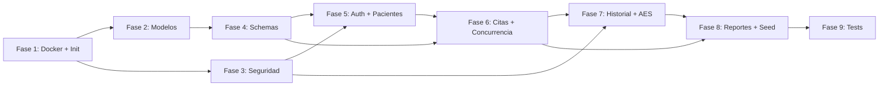

# Plan de Fases — Implementación del Backend

> Documento de seguimiento del plan de implementación del backend del sistema de citas médicas.
> Stack: Python 3.12 + FastAPI + SQLAlchemy 2.0 + PostgreSQL 16 + Docker + Poetry

---

## Fase 1: Inicialización del Proyecto y Entorno Docker ✅

**Objetivo**: Configurar la estructura base del proyecto con Docker Compose, Poetry como gestor de dependencias, y verificar que el servidor FastAPI arranque correctamente con conexión a PostgreSQL.

**Archivos creados**:

| Archivo | Propósito |
|---------|-----------|
| `backend/.env.example` | Template de variables de entorno |
| `backend/.env` | Variables de desarrollo (no versionado) |
| `backend/pyproject.toml` | Dependencias con Poetry |
| `backend/poetry.lock` | Lockfile determinista |
| `backend/Dockerfile` | Imagen Docker con Poetry |
| `docker-compose.yml` | PostgreSQL 16 + API con healthcheck |
| `backend/app/__init__.py` | Paquete Python |
| `backend/app/config.py` | Configuración con pydantic-settings |
| `backend/app/database.py` | AsyncEngine + AsyncSession factory |
| `backend/app/main.py` | FastAPI app con CORS, rate limiting, lifespan |
| `.gitignore` | Exclusiones de Git |

**Variables de entorno configuradas**:
```
DATABASE_URL     → Conexión async a PostgreSQL (asyncpg)
JWT_SECRET       → Clave para firmar tokens JWT
JWT_ALGORITHM    → HS256
JWT_EXPIRE_HOURS → 24h
ENCRYPTION_KEY   → Clave AES-256 (32 bytes hex)
ENVIRONMENT      → development
FRONTEND_URL     → http://localhost:5173
API_PREFIX       → /api/v1
```

**Servicios Docker**:
- `db` — PostgreSQL 16 Alpine con healthcheck (`pg_isready`)
- `api` — FastAPI con hot-reload via volume mount

**Verificación**: `GET /health` → `{"status": "ok"}`, Swagger UI en `/docs`

---

## Fase 2: Modelos SQLAlchemy y Migraciones con Alembic 🔄

**Objetivo**: Definir los 7 modelos ORM alineados con el esquema SQL del documento de diseño (`02_base_datos.md`) y configurar Alembic para migraciones versionadas.

**Modelos a crear**:

| Modelo | Tabla | Campos clave | Relaciones |
|--------|-------|-------------|------------|
| `User` | `users` | username, password_hash, role, active | → Patient, Doctor, Notifications |
| `Patient` | `patients` | user_id FK, full_name, email, phone, age, gender | → User, Appointments, MedicalRecords |
| `Doctor` | `doctors` | user_id FK, full_name, specialty, license_number | → User, Slots, Appointments, MedicalRecords |
| `AvailableSlot` | `available_slots` | doctor_id FK, slot_date, start_time, end_time, is_available, **version** | → Doctor, Appointment |
| `Appointment` | `appointments` | patient_id FK, doctor_id FK, slot_id FK, status, created_by, reason | → Patient, Doctor, Slot, MedicalRecord |
| `MedicalRecord` | `medical_records` | appointment_id FK, patient_id FK, doctor_id FK, encrypted_data (BYTEA), iv (BYTEA) | → Appointment, Patient, Doctor |
| `Notification` | `notifications` | user_id FK, type, message, is_read, reference (JSONB) | → User |

**Aspectos clave**:
- `Base` declarativa con `TimestampMixin` (created_at, updated_at automáticos)
- `AvailableSlot.version` → campo para control de concurrencia optimista
- `MedicalRecord.encrypted_data` → almacena JSON encriptado como BYTEA
- `UNIQUE(doctor_id, slot_date, start_time)` → evita slots duplicados
- Alembic configurado con async engine para generar migraciones automáticas

**Verificación**: `alembic upgrade head` → 7 tablas creadas en PostgreSQL

---

## Fase 3: Utilidades de Seguridad y Encriptación

**Objetivo**: Implementar las funciones core de seguridad reutilizables que consumirán los servicios.

**Archivos**:

| Archivo | Funciones | Librería |
|---------|----------|----------|
| `utils/security.py` | `hash_password()`, `verify_password()`, `create_access_token()`, `decode_access_token()` | passlib[bcrypt], python-jose |
| `utils/encryption.py` | `encrypt_data()`, `decrypt_data()` | cryptography (AESGCM) |
| `dependencies.py` | `get_db()`, `get_current_user()`, `RoleChecker()` | FastAPI Depends |

**Detalles técnicos**:
- **bcrypt**: 12 salt rounds (~250ms por hash)
- **JWT**: HS256, payload con `sub`, `username`, `rol`, `exp`
- **AES-256-GCM**: IV de 12 bytes aleatorio por registro, auth_tag integrado en el ciphertext
- **RoleChecker**: clase callable que actúa como dependency de FastAPI para RBAC

---

## Fase 4: Schemas Pydantic (Request/Response)

**Objetivo**: Definir todos los esquemas de validación para request bodies y response models.

**Schemas por dominio**:

| Archivo | Schemas | Propósito |
|---------|---------|-----------|
| `schemas/common.py` | `SuccessResponse`, `ErrorResponse`, `PaginationMeta` | Formato estándar de respuestas |
| `schemas/auth.py` | `RegisterRequest`, `LoginRequest`, `TokenResponse` | Autenticación |
| `schemas/patient.py` | `PatientResponse`, `PatientUpdate`, `PatientListResponse` | CRUD pacientes |
| `schemas/appointment.py` | `SlotResponse`, `CreateAppointmentRequest`, `AppointmentResponse` | Citas + slots |
| `schemas/medical_record.py` | `CreateMedicalRecordRequest`, `VitalSigns`, `PatientHistoryResponse` | Historial clínico |
| `schemas/notification.py` | `NotificationResponse` | Notificaciones |
| `schemas/report.py` | `PatientReportResponse`, `CalendarReportResponse` | Reportes |

**Ventajas de Pydantic v2**:
- Validación automática al recibir el request (FastAPI retorna 422 con detalles)
- Serialización automática en el response (campo `response_model` en los endpoints)
- Documentación Swagger generada automáticamente

---

## Fase 5: Servicios de Autenticación y Gestión de Pacientes

**Objetivo**: Implementar los primeros endpoints funcionales end-to-end.

**Endpoints**:

| Método | Ruta | Acceso | Servicio |
|--------|------|--------|----------|
| `POST` | `/api/v1/auth/register` | Público | Crea user + patient, retorna JWT |
| `POST` | `/api/v1/auth/login` | Público (rate limited) | Verifica credenciales, retorna JWT |
| `GET` | `/api/v1/patients` | Médico | Lista paginada con búsqueda |
| `GET` | `/api/v1/patients/{id}` | Médico o propio paciente | Detalle |
| `PUT` | `/api/v1/patients/{id}` | Médico o propio paciente | Actualización parcial |
| `DELETE` | `/api/v1/patients/{id}` | Médico | Eliminación |

**Patrón**: Router → Service → SQLAlchemy AsyncSession → PostgreSQL

---

## Fase 6: Servicio de Citas con Control de Concurrencia

**Objetivo**: Implementar la gestión de citas con exclusión mutua distribuida — el módulo más crítico del sistema.

**Endpoints**:

| Método | Ruta | Acceso | Descripción |
|--------|------|--------|-------------|
| `GET` | `/api/v1/slots` | Autenticado | Horarios disponibles por fecha/médico |
| `POST` | `/api/v1/appointments` | Autenticado | **Crear cita (con mutex distribuido)** |
| `GET` | `/api/v1/appointments` | Autenticado | Listar (filtrado por rol) |
| `PUT` | `/api/v1/appointments/{id}` | Autenticado | Modificar |
| `DELETE` | `/api/v1/appointments/{id}` | Autenticado | Cancelar + liberar slot |
| `GET` | `/api/v1/notifications` | Autenticado | Listar notificaciones |
| `PATCH` | `/api/v1/notifications/{id}/read` | Autenticado | Marcar como leída |

**Mecanismo de concurrencia (2 niveles)**:

```
Nivel 1 — Optimista (app):     El cliente envía slot_version
Nivel 2 — Pesimista (DB):      SELECT ... FOR UPDATE bloquea la fila
Transacción:                    SERIALIZABLE isolation level
```

**Flujo de creación de cita**:
1. `SELECT slot FOR UPDATE` → bloquea la fila del horario
2. Verifica `version == client_version` (optimista)
3. Verifica `is_available == True`
4. `UPDATE slot SET is_available=False, version+=1`
5. `INSERT appointment`
6. `COMMIT` → libera el bloqueo

**Cancelación por médico** → genera automáticamente una `Notification` para el paciente.

---

## Fase 7: Historial Clínico con Encriptación AES-256-GCM

**Objetivo**: Implementar el registro de consultas médicas con datos clínicos encriptados.

**Endpoints**:

| Método | Ruta | Acceso |
|--------|------|--------|
| `POST` | `/api/v1/medical-records` | Solo médico |
| `GET` | `/api/v1/medical-records/patient/{id}` | Médico o propio paciente |

**Flujo de encriptación**:
```
Escritura: dict → json.dumps → AESGCM.encrypt(key, iv, plaintext) → BYTEA en DB
Lectura:   BYTEA → AESGCM.decrypt(key, iv, ciphertext) → json.loads → dict
```

**Datos encriptados**: signos vitales (temperatura, peso, altura, presión arterial), diagnóstico, resultados de análisis, prescripciones, observaciones.

---

## Fase 8: Reportes y Datos de Prueba (Seed)

**Objetivo**: Implementar los endpoints de reportes y crear datos de prueba para desarrollo.

**Endpoints**:

| Método | Ruta | Acceso |
|--------|------|--------|
| `GET` | `/api/v1/reports/patients` | Médico |
| `GET` | `/api/v1/reports/calendar?month=2026-05` | Médico |
| `GET` | `/api/v1/reports/history/{patient_id}` | Médico o propio paciente |

**Seed data**: 1 médico (Dr. García), 3 pacientes, horarios para 2 semanas, 5 citas, 2 historiales clínicos.

---

## Fase 9: Pruebas de Integración y Concurrencia

**Objetivo**: Verificar el correcto funcionamiento del sistema con pruebas automatizadas.

**Suites de pruebas**:

| Archivo | Pruebas |
|---------|---------|
| `test_auth.py` | Registro, login, token inválido, usuario duplicado |
| `test_patients.py` | CRUD, permisos RBAC, búsqueda |
| `test_appointments.py` | Crear, cancelar, **N requests simultáneos al mismo slot** |
| `test_medical_records.py` | Crear registro, desencriptar, permisos |

**Test de concurrencia**: Lanza N tareas asyncio contra el mismo slot → solo 1 recibe 201, las demás reciben 409.

---

## Diagrama de Dependencias entre Fases


